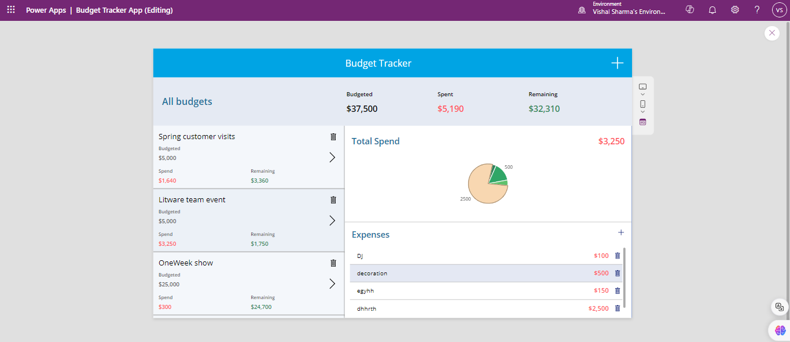
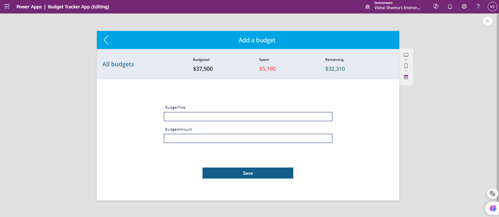
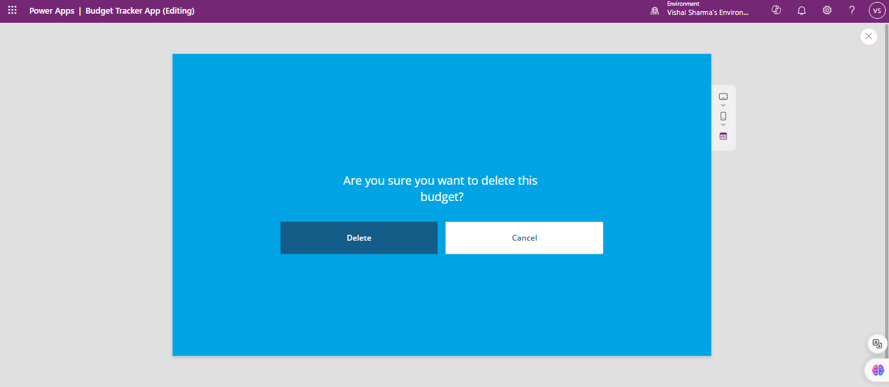
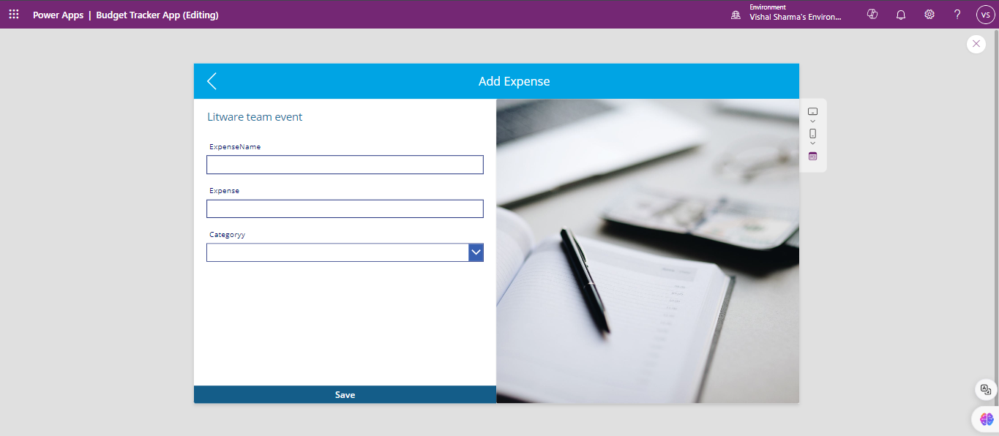
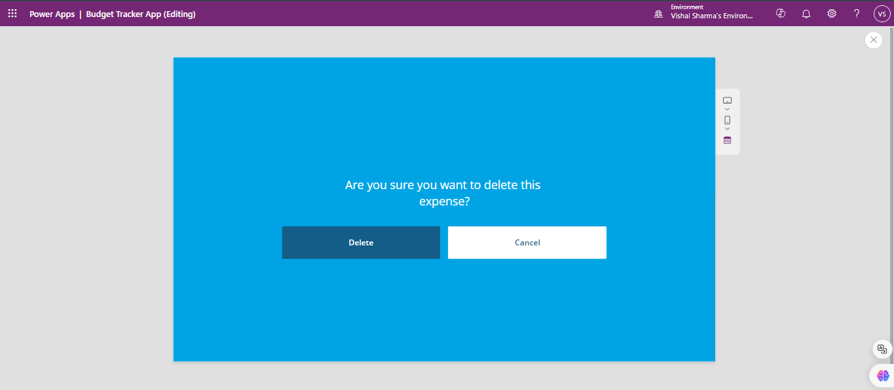
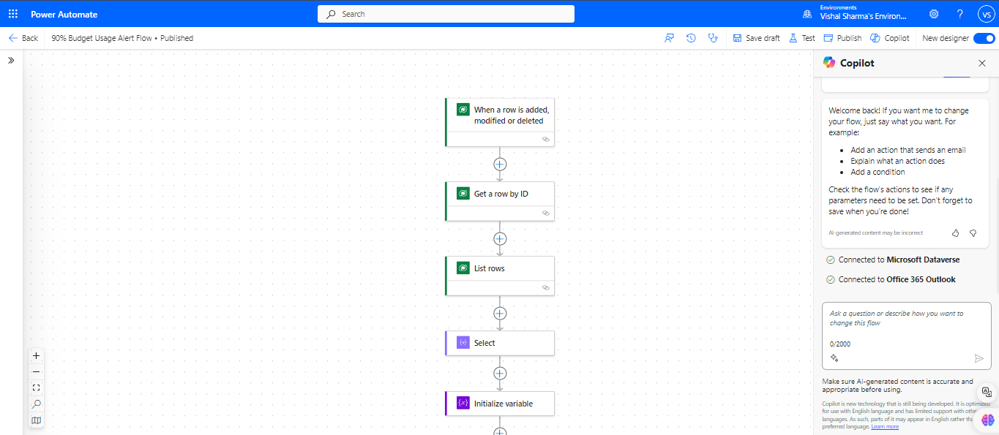
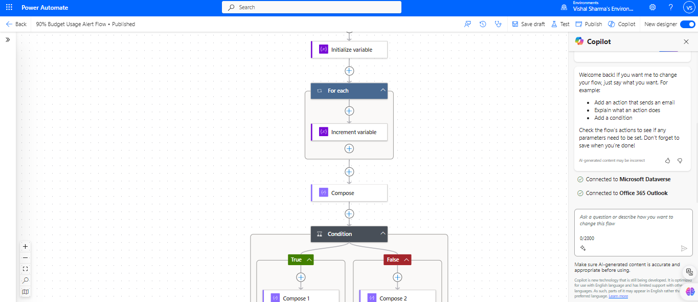
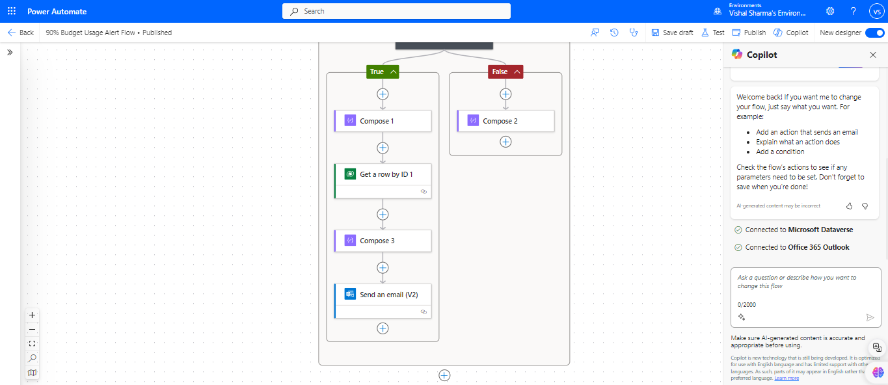

# Budget Tracker Solution

## Overview

The **Budget Tracker** is a Power Platform solution that helps users manage their budgets and expenses effectively. It features a Canvas app with five interactive screens, two Dataverse tables for data management, and a Power Automate flow to notify users when expenses exceed 90% of the allocated budget.

## Features

- **Canvas App (5 Screens)**:

  1. **Home**: Overview of all active budgets and expenses.
  2. **Create Budget**: Allows users to create a new budget by entering the title and amount.
  3. **Delete Budget**: Allows users to delete an existing budget from the system.
  4. **Create Expense**: Enables users to log expenses associated with a particular budget.
  5. **Delete Expense**: Allows users to delete a recorded expense.

- **Dataverse Tables**:

  - **Budget Table**: Stores the budget title and allocated amount.
  - **Expense Table**: Stores expense details like the expense name, amount, and the related budget (via lookup).

- **Power Automate Flow**:
  - Monitors expenses and triggers notifications when they exceed 90% of the allocated budget.

## Technology Stack

- **Power Platform**: Canvas App for UI and interactions, Power Automate for flow automation.
- **Dataverse**: Data storage with Budget and Expense tables.
- **Power Automate**: Alerts users when the 90% expense threshold is met.

## Screenshots

### Home Screen

_The Home screen provides an overview of all budgets and expenses._

### Create Budget Screen

_Create a new budget with the budget title and amount._

### Delete Budget Screen

_Delete an existing budget from the system._

### Create Expense Screen

_Log an expense and associate it with a specific budget._

### Delete Expense Screen

_Remove an expense from the system._

## Power Automate Flow

This solution includes a **Power Automate Flow** that monitors budget expenses and sends an alert when expenses exceed 90% of the allocated budget. Below are the steps involved in the flow:

### Flow Overview

_The complete flow monitors budget expenses and triggers notifications when the 90% threshold is crossed._

### Condition Check

_This step checks if the total expenses exceed 90% of the allocated budget._

### Notification Trigger

_If the condition is met, an alert is triggered to notify the user of potential budget overspending._
